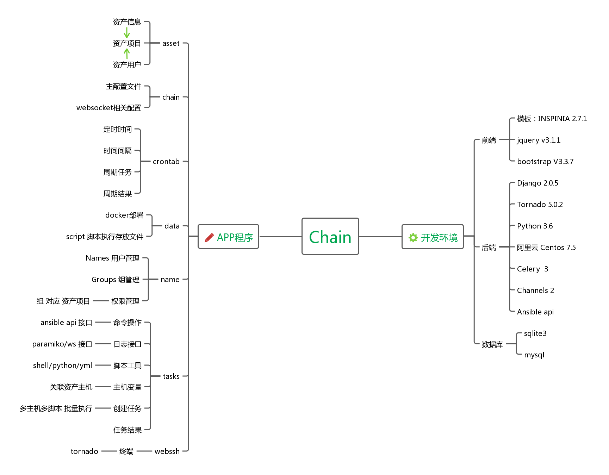
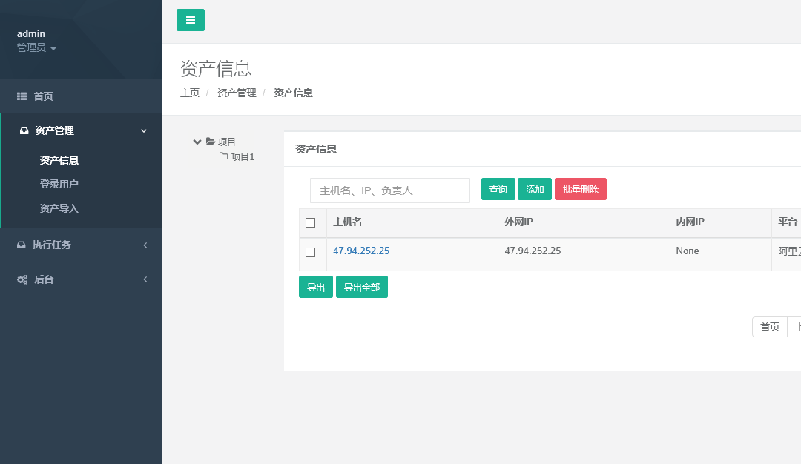
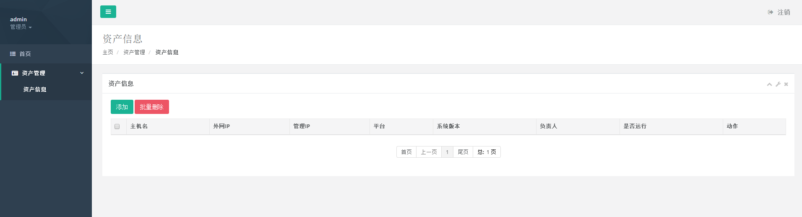
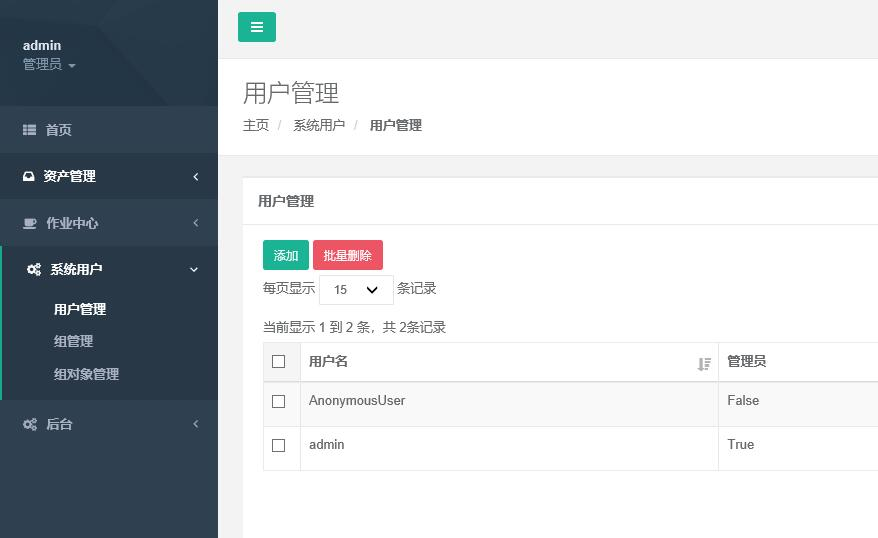
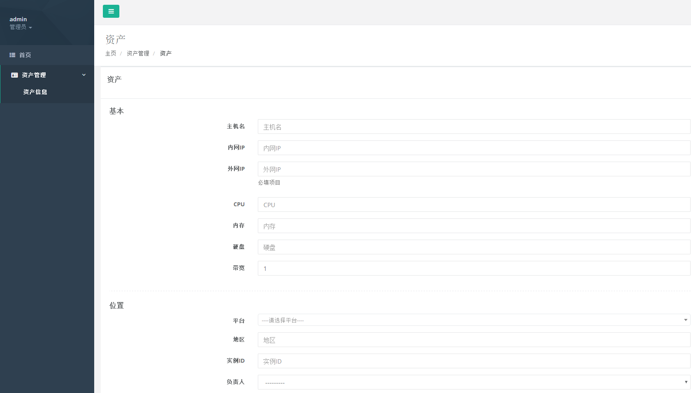
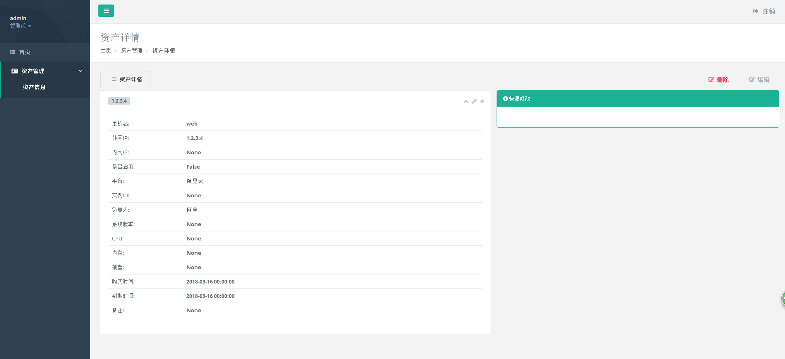

# 链喵 CMDB


## 推荐一下 现在自己在做的  django 基础开发模板

https://github.com/hequan2017/seal/

## 介绍

重要通知：因本人工作原因，本项目就此完结。之后不提供更新和维护。


项目中文名：链喵

项目英文名：chain 

linux 云主机 管理系统,包含 CMDB系统,webssh登录、命令执行、异步执行shell/python/yml、查看日志、定时任务等功能。

* 交流群号： 620176501  <a target="_blank" href="//shang.qq.com/wpa/qunwpa?idkey=bbe5716e8bd2075cb27029bd5dd97e22fc4d83c0f61291f47ed3ed6a4195b024"></a>

---

## 目录结构


  *  asset     资产
        * api   asset/api/asset.html
  *  chain      主配置目录
  *  crontab    定时任务
  *  data       测试数据/Dockerfile目录
  *  index      首页及用户处理
  *  tasks      任务
  *  name       系统用户 |　组　｜ 权限
  *  static     css | js  
  *  templates  静态模板
  *  webssh     终端ssh登录     参考的  https://github.com/huashengdun/webssh   此项目

##  权限

关于权限,采用的为 django-guardian  对象权限  和 django自带auth权限 相结合


举个例子:
  * 新建一个资产项目  [运维]  新建一个资产 [web01]  和 资产用户 [web01-root] 分配到 [运维] 项目下
  
  * 新建一个用户  [hequan]  , 将 [hequan] 分配到用户组  [ops].
  
  * 系统用户--组对象权限 |  添加  对象类型:[资产项目]  资产项目:[运维]  组:[ops]  权限:[asset | 资产项目 | 只读资产项目]
  * [ hequan ]  获得  [web01] [web01-root]  [运维]  可读权限
  
  * 小权限分5类:  [可读   添加（没用到）  修改   删除    执行（后面用来执行cmd 和工具）]
  
  * [admin]  默认有所有权限
  
  * 如果想让 [hequan] 有添加资产权限,  选择  系统用户 -- 用户或者组   选择  Can  add  资产管理
  
  * 普通用户 无权限 管理系统用户 和 登录后台


###  环境


前端模板：
  * INSPINIA 2.7.1  

后端：
  * django 2.0.5
  * Python 3.6.5
  
运行环境：
  * 阿里云  Centos 7.5

数据库：
  * 目前开发阶段 用的 sqlite3,可无缝切换为 mysql


###  部署


```bash
git clone https://github.com/hequan2017/chain.git
```

修改 chain/settings.py
```bash
web_ssh = "47.104.140.38"    ##修改为本机外网IP
web_port = 8002
```

```bash


mkdir /etc/ansible/
cd chain/


yum  install   sshpass  bzip2  redis  wget  -y
systemctl start redis

cd /tmp/
wget https://files.pythonhosted.org/packages/12/2a/e9e4fb2e6b2f7a75577e0614926819a472934b0b85f205ba5d5d2add54d0/Twisted-18.4.0.tar.bz2
tar xf Twisted-18.4.0.tar.bz2
cd Twisted-18.4.0
python3 setup.py install


pip3   install -r   requirements.txt

```

```bash
cd  chain/
python3     manage.py   makemigrations
python3     manage.py   migrate

python manage.py  shell
from  name.models import Names
user=Names.objects.create_superuser('admin','hequan@test.com','1qaz.2wsx')
exit()

python3   manage.py runserver 0.0.0.0:80

python3    webssh/main.py    ##启动终端登录功能

celery -B   -A  chain  worker  -l  info
```

```bash
如果遇到报错 ImportError: No module named '_sqlite3' ,可以执行下面的操作

yum -y install sqlite-devel

重新编译python3.6.5

想在windows 环境下运行,请注释 tasks/views.py  以下两行

from   task.ansible_2420.runner import AdHocRunner
from   task.ansible_2420.inventory import BaseInventory

```

###   截图






---
### 作者

#### 0.2
- 何全
- 盘振鹏
