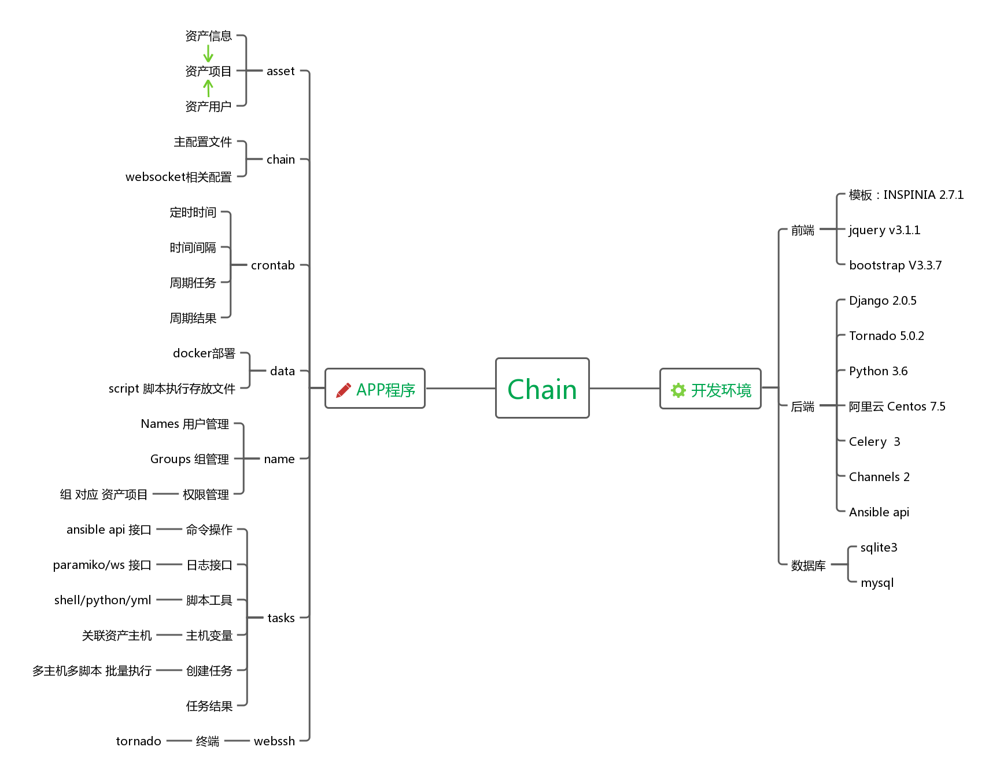
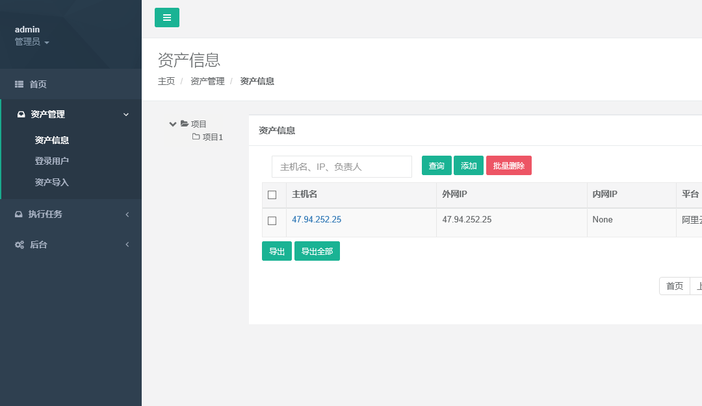
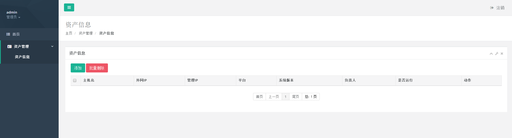
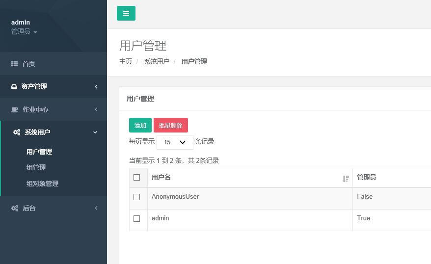
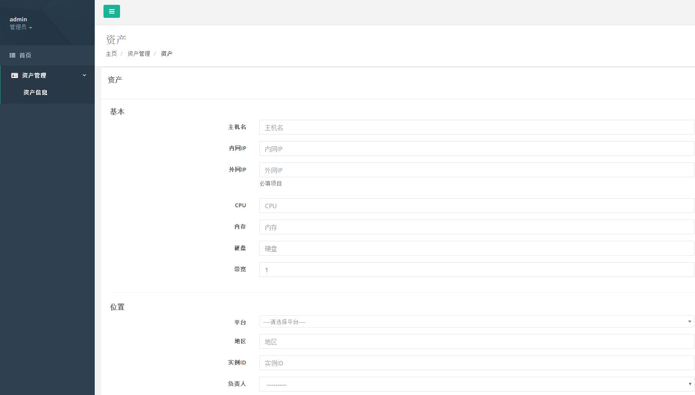
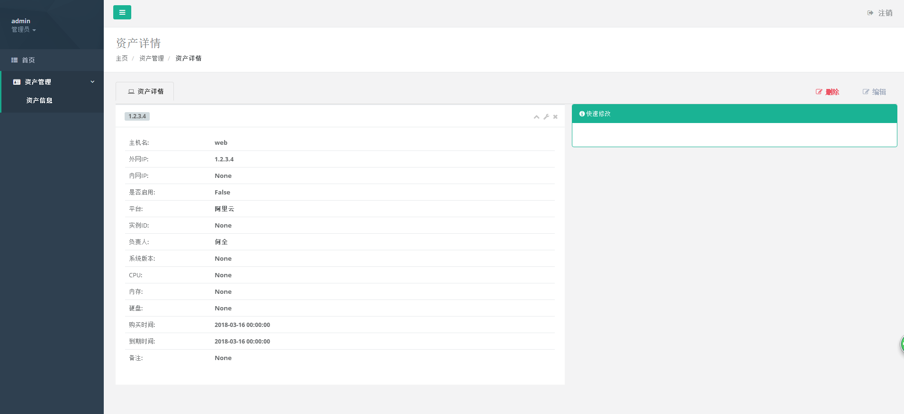

[简体中文](README.md) | [English](README.en.md)

# 链喵 CMDB（chain）


> **⚠️ 本项目已停止开发！** 因本人工作原因，本项目就此完结，之后不再提供更新和维护。因长时间未对代码进行维护，可能会造成项目在不同环境上无法部署、运行 BUG 等问题，请知晓！**项目仅供参考。**

## 📖 项目介绍

链喵（chain）是一个基于 Django 开发的 **Linux 云主机管理系统**，集 CMDB 资产管理、WebSSH 终端登录、批量命令执行、异步脚本执行、日志跟踪、定时任务等功能于一体，版本 v1.0.0 为最终版本。

它面向中小规模的运维场景：把主机资产、登录凭据、批量操作和定时任务放在同一个后台里统一管理，并通过 django-guardian 对象权限实现"按项目分配资产"的细粒度授权。

在原有资产管理基础上，项目还补充了容器平台管理入口（Docker 主机 / K8s 集群的信息维护），并为资产 API 增加了常用的查询过滤能力。

## ✨ 功能特性

- **资产管理（CMDB）**：主机增删改查，记录内网/外网 IP、系统版本、CPU、内存、硬盘、外网带宽、平台、区域、实例 ID 等；支持一键更新硬件信息、CSV 导出
- **Docker 管理**：维护 Docker 主机信息（名称、API 地址、所属项目/业务、版本、激活状态等），导航位于 `资产管理 -> Docker管理`
- **K8s 管理**：维护 Kubernetes 集群信息（集群名、API Server、默认命名空间、所属项目/业务、版本、激活状态等），导航位于 `资产管理 -> K8s管理`
- **WebSSH 终端**：Tornado + Paramiko 实现浏览器 SSH 终端（参考 [huashengdun/webssh](https://github.com/huashengdun/webssh)），从资产列表一键登录，密码使用 Fernet 加密存储
- **命令执行**：基于内置 Ansible Runner（tasks/ansible_2420）对资产批量执行命令
- **异步脚本执行**：支持 shell / python / yml 三类脚本，工具库统一管理，执行结果留存可查
- **变量组**：为脚本执行定义变量组并关联资产，复用批量任务参数
- **日志跟踪（Tail）**：实时跟踪远程服务器日志输出
- **定时任务**：Celery + django-celery-beat，可视化维护 Crontab / Interval 计划任务
- **用户 / 组 / 权限**：django-guardian 对象权限与 Django 自带 auth 权限相结合，小权限分五类（可读、添加、修改、删除、执行），并记录用户登录历史
- **资产 API**：DRF 列表接口支持 `keyword`（主机名/IP/项目/业务模糊查询）、`project`、`business`、`is_active`（true/false/1/0）过滤，以及 `ordering` 白名单字段排序（非法参数自动回退默认排序）
- **后台增强**：django-jet 美化后台、pure-pagination 分页、自定义 404/500 页面

<details>
<summary>🔑 权限模型举例（来自原 README）</summary>

* 新建一个资产项目 [运维]，新建一个资产 [web01] 和资产用户 [web01-root]，分配到 [运维] 项目下
* 新建一个用户 [hequan]，将 [hequan] 分配到用户组 [ops]
* 系统用户--组对象权限：添加 对象类型 [资产项目]、资产项目 [运维]、组 [ops]、权限 [asset | 资产项目 | 只读资产项目]
* [hequan] 即获得 [web01]、[web01-root]、[运维] 的可读权限
* [admin] 默认拥有所有权限；普通用户无权管理系统用户和登录后台
* 若想让 [hequan] 有添加资产权限，在 系统用户 -- 用户或者组 中勾选 Can add 资产管理

</details>

## 🛠 技术栈

| 层次 | 技术 |
| --- | --- |
| 后端 | Python 3.6、Django 2.0.13、Django REST Framework 3.8.2、Celery 4.2.1（django-celery-beat / django-celery-results）、Channels 2.0 + Daphne、django-guardian 1.4.9、Ansible 2.6.3、Tornado 5.0 + Paramiko、Redis |
| 前端 | INSPINIA 2.7.1 模板、Bootstrap、pyecharts |
| 数据库 | SQLite3（开发环境，依赖含 mysqlclient / PyMySQL，可无缝切换 MySQL） |
| 实测环境 | 阿里云 CentOS 7.5 |

## 🚀 快速开始

```bash
git clone https://github.com/hequan2017/chain.git
```

修改 `chain/settings.py`：

```python
web_ssh = "47.104.140.38"    ##修改为本机外网IP
web_port = 8002
```

安装系统依赖（CentOS 7）：

```bash
mkdir /etc/ansible/
cd chain/

yum install sshpass bzip2 redis wget -y
systemctl start redis

# 编译安装 Twisted（如 pip 安装失败）
cd /tmp/
wget https://files.pythonhosted.org/packages/12/2a/e9e4fb2e6b2f7a75577e0614926819a472934b0b85f205ba5d5d2add54d0/Twisted-18.4.0.tar.bz2
tar xf Twisted-18.4.0.tar.bz2
cd Twisted-18.4.0
python3 setup.py install

pip3 install -r requirements.txt
```

初始化并启动：

```bash
cd chain/
python3 manage.py makemigrations
python3 manage.py migrate

# 若拉取了包含 Docker/K8s 新功能的代码，请确保执行迁移
python3 manage.py makemigrations asset
python3 manage.py migrate

# 创建管理员
python3 manage.py shell
from name.models import Names
user = Names.objects.create_superuser('admin', 'hequan@test.com', '1qaz.2wsx')
exit()

# 启动 Web 服务
python3 manage.py runserver 0.0.0.0:80

# 后台常驻方式
nohup python36 manage.py runserver 0.0.0.0:8003 >> /tmp/chain-http.log 2>&1 &

# 启动 WebSSH 终端登录功能
python3 webssh/main.py

# 启动 Celery 定时任务
celery -B -A chain worker -l info
```

常见问题：

```bash
# 报错 ImportError: No module named '_sqlite3'
yum -y install sqlite-devel
# 然后重新编译 Python 3.6.5

# 想在 Windows 环境下运行，请注释 tasks/views.py 中以下两行
# from tasks.ansible_2420.runner import AdHocRunner
# from tasks.ansible_2420.inventory import BaseInventory
```

## 📁 目录结构



```text
├── asset       资产（含 asset/api/asset.html 资产 API）
├── chain       主配置目录
├── crontab     定时任务
├── data        测试数据 / Dockerfile 目录
├── index       首页及用户处理
├── tasks       任务（命令/脚本执行、日志跟踪）
├── name        系统用户 | 组 | 权限
├── static      css | js
├── templates   静态模板
└── webssh      终端 SSH 登录（参考 https://github.com/huashengdun/webssh）
```

## 📸 截图







## 🔗 相关项目

同作者（hequan2017）的其他运维项目：

- [autoops](https://github.com/hequan2017/autoops)：Linux 资产管理（CMDB）、WebSSH、自动化运维平台
- [cmdb](https://github.com/hequan2017/cmdb)：资产管理、主机管理、批量执行命令/脚本、流量图、WebSSH
- [husky](https://github.com/hequan2017/husky)：Django 之入门 CMDB 系统（教程项目）

## 📄 License

本项目基于 [Apache License 2.0](LICENSE) 开源。

## 💬 交流群

交流群号：620176501

<a target="_blank" href="//shang.qq.com/wpa/qunwpa?idkey=bbe5716e8bd2075cb27029bd5dd97e22fc4d83c0f61291f47ed3ed6a4195b024"></a>
